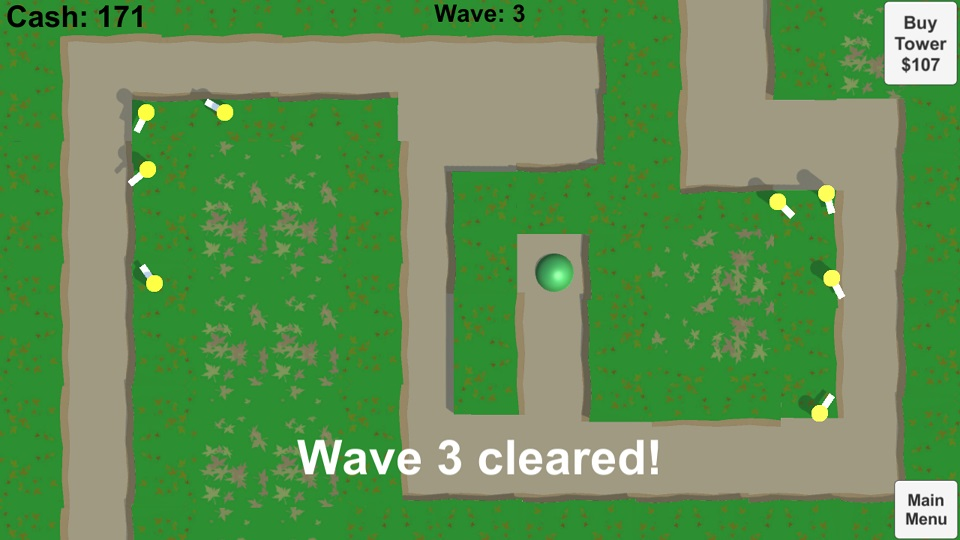
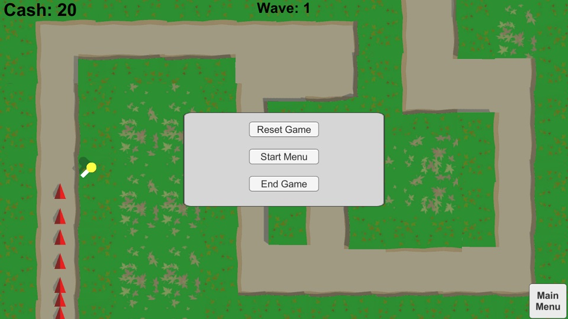
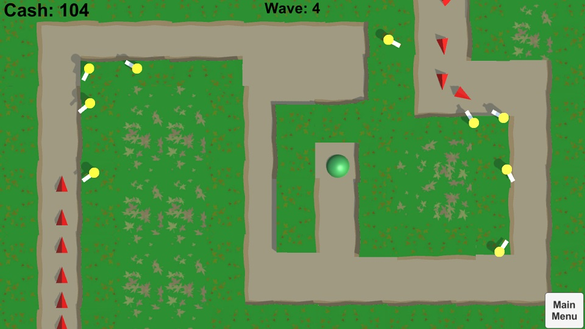

This is a sample project that implements a basic, bare-bones tower defense style game in Unity. Features a main menu, arbitrary tower placement, multiple rounds and difficulties, multiple enemy types, and predetermined enemy routes.

All code and assets original.

